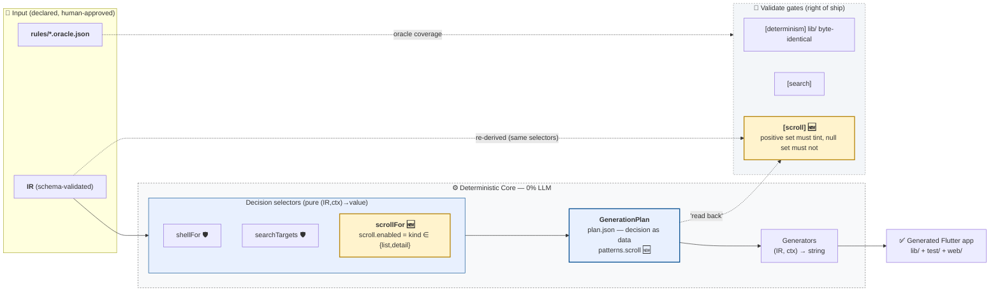

# P3 — Per-Screen On-Scroll AppBar Tint: Decision Brief

> **Audience:** owner. **Purpose:** make an informed go/no-go on the P3 slice (scroll behavior)
> before/at implementation. **Form:** executive summary → context → why → options (with
> priority/impact) → findings → recommendation. Companion to `SPIKE_PLAN.md` §P3 and
> `INTERFACE_PATTERN_CONTRACT.md` §5 (the engineering specs).

**Status: IMPLEMENTED AS DECIDED.** Date 2026-08-17. Commit `f0254f9`.

---

## 0. Diagrams — where P3 sits

Legend of shading: **amber** = the area this brief decides on (the new `[scroll]` gate + the
`scrollFor` selector); **light blue** = "decision as data" (the plan selectors, incl. the new
`scrollTargets`); **dashed** = gate/validate groupings.

### Pipeline (IR → selectors → plan → generators → gates)



### Sequence — scroll decided at composition, rendered by screen.ts, re-proven by [scroll]

```mermaid
sequenceDiagram
    autonumber
    participant O as Owner
    participant C as composition.ts<br/>(scrollFor / scrollTargets)
    participant P as plan.json<br/>patterns.scroll
    participant S as screen.ts<br/>(template tag *_scroll)
    participant V as validate.ts<br/>[scroll] gate
    participant F as Flutter app
    Note over O,C: IR is BLOCKED until human approval (AGENTS #3 trust boundary)
    O->>C: approved IR (list/detail/wizard screens)
    rect rgb(255,243,205)
        Note over C,P: P3 area ① — declared rule + decision-as-data
        C->>C: scrollFor: kind ∈ {list,detail} ? ScrollSpec : null
        C->>P: scrollTargets re-keyed by screenPath → patterns.scroll
    end
    rect rgb(232,240,254)
        Note over P,S: P3 area ② — render, never re-derive
        P->>S: ctx.scroll (name-keyed ScrollSpec)
        S->>S: scrollEnabled ? listener + _scrolled : plain template
        S->>F: AppBar bg: _scrolled ? surfaceContainerHighest : null
    end
    rect rgb(255,243,205)
        Note over V: P3 area ③ — [scroll] gate re-proves
        V->>V: re-derive via SAME scrollTargets
        V->>V: diff vs plan.json + scan every generated screen
        alt list/detail renders listener; wizard/form does not
            V-->>F: PASS (byte-identical at rest)
        else listener stripped / stale plan entry / wizard got listener
            V-->>V: [scroll] FAIL — fix generator, not output
        end
    end
```

(PNG renders under `research/mermaid/p3_pipeline.png`, `p3_sequence.png` — embedded in the PDF
version, which is the deliverable.)

---

## 1. Executive summary

P3 adds the Material-Expressive "tint the AppBar when the content scrolls" behavior to generated
screens, gated behind a **declared contract rule** (ChatGPT round-2 edit #2):

> `scroll.enabled = screen.kind ∈ { list, detail }`

One pure selector (`scrollFor`) decides every screen's scroll capability at composition time;
`screen.ts` renders a `NotificationListener<ScrollNotification>` + a widget-local `_scrolled`
flag only when handed that decision; a new `[scroll]` validate gate re-proves the decision by
re-deriving through the **same** selector and diffing both `plan.json` and every generated screen.

The state-management posture is deliberately **agnostic** (unlike P2 search's bloc-only
carve-out): the tint is pure presentation, so the riverpod sample gets the same listener — no
latent `[scroll]` gate gap waiting for a riverpod list/detail IR.

Effort ~S (1 slice). Impact: ships the scroll pattern roadmap item; hardens the "decision as
data" invariant to a per-screen level.

## 2. Context

- The roadmap's P3 is "scroll behavior". The interface-pattern contract §5 pins the semantic:
  on-scroll AppBar tint as an **additive** behavior (no layout change, no content refactor), and
  explicitly carves out `IR state ≠ scroll/UI state` — `_scrolled` is widget-local, never IR.
- Non-goals set at planning: no pagination, no fetch-on-scroll (both candidate P6). Keep the
  slice small per AGENTS #2.
- P2 (search) established the pattern P3 generalizes: `searchTargets` (composition) → `ctx.search`
  → plan.json `patterns.search` → `[search]` gate. P3 reuses the same shape for scroll, and the
  S-CTX `[plan-determinism]` gate (previous slice) already proves `patterns.scroll` is written
  deterministically.
- At-rest pixels must stay byte-identical: `backgroundColor: _scrolled ? … : null` where `null`
  means "theme default". Proven on every IR (wizard screen byte-identical pre/post P3; list/detail
  at-rest 0/329160 px diff pre/post).

## 3. Why it matters (impact)

| Impact axis | With P3 | Without |
|---|---|---|
| **Roadmap** | P3 closed; P4/P5 build on the same selector+gates shape | stuck before the "active" slice |
| **UX polish** | Material-Expressive scroll feedback ships to every list/detail | flat AppBar, no scroll affordance |
| **Trust boundary** | `[scroll]` proves list/detail tints AND wizard/form don't (null set is a *checked* claim, not a hope) | a future template edit could tint wizards silently |
| **SM agnosticism** | riverpod + bloc both tint (no latent gate gap like search's bloc-only note) | only bloc apps would get the pattern |
| **Regression surface** | at-rest byte-identical → goldens unchanged; only scrolling screens differ | — |

## 4. Options (with priority + impact)

| # | Option | Priority | Effort | Impact | Verdict |
|---|---|---|---|---|---|
| A | **Declared rule (kind ∈ {list,detail}) + `[scroll]` gate + SM-agnostic render + negative control** | P1 | S | High — closes P3, extends decision-as-data to every screen, null-set proven | **IMPLEMENTED** |
| B | Selector default only (no declared rule, no gate) | P2 | XS | Medium — ships the tint but drift is invisible; violates "no silent defaults" | rejected |
| C | Scroll only on list, not detail | P3 | XS | Low — detail screens (long field lists) also scroll; rule would be arbitrary | rejected (contract §5 says list+detail) |
| D | Include pagination / fetch-on-scroll | P3 | L | High feature value but doubles slice size, breaks small-slice rule, needs new IR semantics | DEFER → P6 candidate (note in leftovers) |
| E | Bloc-only carve-out (mirror P2 search) | P3 | S | Lower — riverpod apps silently lack the pattern; creates the same latent-gap debt search has | rejected (tint is presentation, cheap to emit everywhere) |

## 5. Findings (grounded, from code)

- `scrollFor` (`composition.ts:207`) implements the declared rule verbatim:
  `if (screen.type === "list" || screen.type === "detail") return { enabled: true }; return null;`
  — the ONE place that decides; `screen.ts` only renders the `ScrollSpec` it's handed (contract §1
  master principle).
- `scrollTargets` (`composition.ts:232`) is name-keyed (same shape as `searchTargets`);
  `index.ts` re-keys by `screenPath()` into plan.json `patterns.scroll` (`index.ts:747` 9th
  `writePlan` param) — mirror of the `[search]`/`[plan-determinism]` handling.
- `screen.ts` render: `scrollEnabled = !!ctx?.scroll?.get(s.name)` (`screen.ts:210`).
  `needsLocalState = scrollEnabled || searchEnabled` (`screen.ts:763`) — riverpod list/detail
  becomes `ConsumerStatefulWidget` (`ref` is a getter on `ConsumerState`), bloc list/detail becomes
  `StatefulWidget` only when scroll or search needs it; template tag gains `_scroll` suffix.
  AppBar `backgroundColor: _scrolled ? Theme.of(context).colorScheme.surfaceContainerHighest : null`
  — `surfaceContainerHighest` is a **stock M3 token** (passes the `[architecture]` raw-color gate);
  `null` at rest = theme default.
- `[scroll]` gate (`validate.ts:404` `scrollCheck`, exported for the harness) re-derives via the
  **same** `scrollTargets`, cross-checks `plan.json patterns.scroll` (missing/wrong/stale entries
  all flagged), then scans **every** generated screen: list/detail must render
  `NotificationListener<ScrollNotification>`, wizard/form must NOT.
- **Negative controls (both directions proven):**
  - Plan-side: stale `patterns.scroll["/bogus"]` injected into tasks plan.json → `[scroll] FAIL(1)`
    AND `[plan-determinism] FAIL(1)`; regen restored.
  - Output-side: `apps/tasks/output/qa/p3-scroll/scroll_negative_harness.ts` strips the listener
    from a fresh generate → `[scroll] FAIL(1)` ("in patterns.scroll but its generated screen has no
    NotificationListener"); control PASS.
- **Byte-identical proofs:** pre-P3 generator vs post-P3 (stash-based): wizard screen
  (`signup_wizard_screen.dart`) diff EMPTY; tasks list/detail at-rest renders 0/329160 px diff
  (CDP pixel comparison).
- **CDP walk** (tasks web build on the tailnet, CFT headless + shared driver): wheel-scroll over a
  300px viewport flips the AppBar to `(244,251,248)→(204,218,215)` on list AND detail; scrolling
  back to top restores the original byte-identically; no overflow/console errors at
  320/390/768/1280. Evidence under `apps/tasks/output/qa/p3-scroll/cdp/`.
- Full sweep: typecheck clean; 13/13 IRs regen+validate PASS (`[scroll] [search] [shell]
  [plan-determinism] [determinism] [verdict]`); tasks (bloc) + `todo.riverpod` samples analyze
  clean and tests green (riverpod golden freshly captured).
- **Pre-existing (not P3):** `test/temp_all_flows_test.dart` (P1-era all-flows harness) fails 5
  goldens before AND after P3 with `ArgumentError: Type TaskRepository is already registered inside
  GetIt` — the harness calls `setupDependencies()` per test into a shared GetIt singleton. Not a
  pixel diff, not a regression; tracked in `LEFTOVER_NOTES.md`.

## 6. Decision

**GO — Option A, implemented as commit `f0254f9`:**
1. `composition.ts` — `ScrollSpec` + `scrollFor` (declared rule) + `scrollTargets`.
2. `plan.ts`/`gen_context.ts` — `patterns.scroll` + `ctx.scroll`.
3. `screen.ts` — SM-agnostic `NotificationListener` render, `_scrolled` local state, M3 token tint.
4. `validate.ts` — `[scroll]` gate (re-derive via same selector; positive set must tint, null set
   must not).
5. Negative control harness + CDP probe evidence under `apps/tasks/output/qa/p3-scroll/`.

Acceptance met: 13/13 IRs validate; negative controls fail as proven; wizard byte-identical;
typecheck clean; CDP tint verified + reverts; no overflow across breakpoints.

**Next:** P4 (ActionSpec v1 — `presentation: inline|overflow|primary`) then P5/D2
(state-model-conditional triad), same loop.
