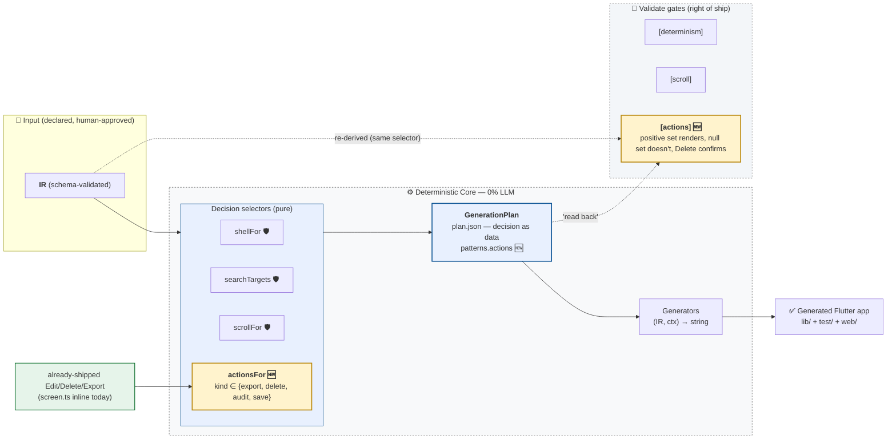
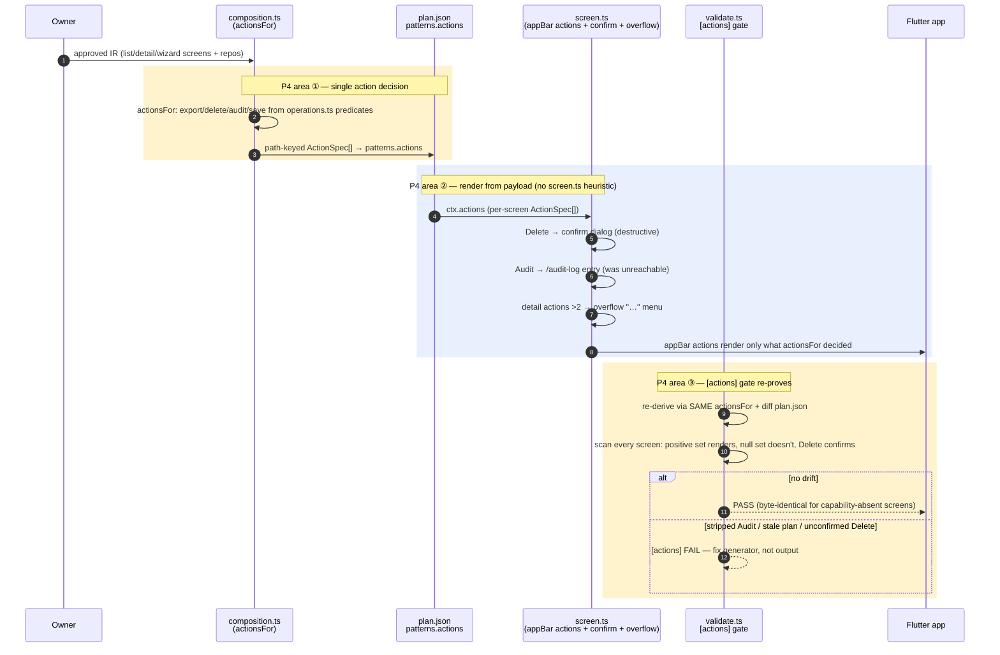

# S-P4 — Capability-Driven Actions: Decision Brief

> **Audience:** owner. **Purpose:** informed go/no-go on the P4 slice after the spike.
> **Form:** executive summary → context → why → options (with priority/impact) → findings →
> decision. Companion to `SPIKE_PLAN.md` §P4, `INTERFACE_PATTERN_CONTRACT.md` §6, and
> `research/SPIKE_P4_REPORT.md` (the full spike report, §17 format).

**Status: MODIFY — adopt reduced scope, subject to your go.** Date 2026-08-17.

---

## 0. Diagrams — where the P4 action selector sits

Legend: **amber** = what this brief decides (the `actionsFor` selector + `[actions]` gate);
**light blue** = decision-as-data; **dashed** = gate groupings; **green** = already-shipped action
emission being re-homed through the selector (consolidation, not new UI).

### Pipeline — actions decided once, rendered from the payload

### Sequence — one selector, Delete confirms, Audit becomes reachable

(PNG renders under `research/mermaid/p4_pipeline.png`, `p4_sequence.png` — embedded in the PDF.)

---

## 1. Executive summary

The spike inspected what the generator already ships vs what P4 proposes. **Edit, Delete, and
Export are ALREADY capability-driven** with deterministic homes (`screen.ts` `appBarActions` +
`resolveExport`) — P4's "derive from operations.ts" is partly done. What P4 genuinely adds, and
is worth doing, is narrow:

1. **Delete confirm dialog** — today a delete is one tap, immediate, unrecoverable.
2. **Audit entry point** — `AuditLogScreen` + `/audit-log` route are *generated* (hr_service) but
   **unreachable from any button**. An audit trail you can't open is invisible.
3. **`[actions]` gate + `patterns.actions`** — the decision-as-data hardening (same posture as
   `[scroll]`/`[search]`/`[plan-determinism]`).

But **two parts of the proposal as written are rejected**:
- **Save-as-extended-FAB** — the form already has an in-body `PrimaryButton('Create'/'Save')`.
  A FAB would render **two** save affordances on one form. Keep the existing button; `Save` stays
  a documented kind only.
- **A third action-decision home** — the spike found the risk of *fragmenting* one decision
  across `actionsFor` + the existing inline blocks. It must be a **consolidation**, not a new
  parallel source of truth.

**Decision: MODIFY.** Reduced scope = confirm dialog + audit entry + overflow "…" menu + one
selector + `[actions]` gate, re-homing the existing Edit/Delete/Export emission. Estimated M
(one slice). Byte-identical for screens with no applicable capability.

## 2. Context

- Contract §6 (P4) + round-2 edit #3 froze the v1 `ActionSpec`:
  `{kind, label, icon, enablement, confirm?, presentation: inline|overflow|primary}` — `params`
  dropped. The 4-kind closed vocabulary (export/delete/audit/save) resolves grills C9 (schema),
  C10 (build-time vs runtime), C13 (icon allowlist), C16 (closed capability vocabulary).
- P1/P2/P3 (shell/search/scroll) established the exact loop this slice reuses: selector in
  `composition.ts` → plan.json payload → generator renders → validate gate re-derives.
- Today's emission is inline in `screen.ts` (`appBarActions` `:726-729`, `exportButtons`
  `:683-721`) — deterministic, but not represented in plan.json and not gated. P4 formalizes it.

## 3. Why it matters (impact)

| Impact axis | With P4 (reduced) | Without |
|---|---|---|
| **Data safety** | Delete requires confirm (recoverable mistakes) | one-tap irreversible delete |
| **Audit value** | audit trail is reachable from the detail screen | generated-but-invisible audit (wasted capability) |
| **Trust boundary** | actions proven in plan.json + `[actions]` gate | action decisions are unproven inline blocks |
| **Consistency** | ONE selector owns all action decisions | three inline homes (crudTarget/quickDecision/export) |
| **Goldens** | only screens gaining Audit/confirm change; capability-absent byte-identical | — |

## 4. Options (with priority + impact)

| # | Option | Priority | Effort | Impact | Verdict |
|---|---|---|---|---|---|
| A | **Reduced P4**: `actionsFor` single selector + Delete confirm + Audit entry + overflow "…" + `[actions]` gate, re-homing existing emission | P1 | M | High (data safety + audit reachability + trust hardening) | **RECOMMENDED (MODIFY)** |
| B | P4 as written (adds extended-FAB Save) | P1 | M+ | Negative on forms — two save affordances; more golden churn | rejected (regression) |
| C | Confirm dialog + Audit entry only, no selector/gate | P2 | S | Medium — fixes UX gaps but actions stay unrepresented in plan.json | acceptable fallback |
| D | Do nothing (status quo) | — | 0 | None — audit stays invisible, deletes unrecoverable, actions unproven | rejected |
| E | Extend scope: runtime per-user authorization around actions | P3 | L | High but needs the auth model (MF2 evolution), out of P4's build-time scope (C10) | DEFER (future auth spike) |

## 5. Findings (grounded, from code)

- `operations.ts` already provides every predicate P4 needs: `crudOperations` (`:39`),
  `crudFormTargets` (`:73`), `quickDecisionTargets` (`:101`), `hasAudit`/`isAudited` (`:381/:385`),
  `resolveExport`/`hasExport` (`:408/:431`) — no new predicates required (C16 formalized).
- Edit/Delete already inline on detail (`screen.ts:726-729`, decided by `canEditCreate`/
  `canDelete` at `:246-247`); Export already inline on list (`:683-721`, bloc-only guard `:692`).
- **No `showDialog`/`AlertDialog` anywhere** in generated detail screens (delete is unconfirmed).
- hr_service `LeaveRequest` is `audited:true`; `core/audit.dart` + `core/audit_log_screen.dart`
  + `/audit-log` route all generated; `[audit]` gate passes — but `rg` finds **zero navigation
  to `/audit-log`**. The audit screen is unreachable.
- Ledgerly is multi-feature (`features[]`), tasks/hr_service/work_auth single-feature with
  top-level `screens` — `actionsFor` must handle both (same flattening `shellFor` already does).
- No `PopupMenuButton`/`more_vert` anywhere today; overflow grouping is new. Only
  hr_service's LeaveRequest detail would reach >2 actions (Edit+Delete+Audit).
- plan.json `patterns` per app: `{scroll, search}` (single-feature), `+ shell` (ledgerly). No
  `actions` key; `[actions]` gate is new.

## 6. Decision

**GO — Option A (MODIFY).** Implement as one slice, per `SPIKE_P4_REPORT.md` §14:
1. `composition.ts`: `ActionSpec` (`params` dropped) + `actionsFor(screen, entity, repo, ir)` —
   the SINGLE action decision + action→icon stem map.
2. `plan.ts`/`gen_context.ts`: `patterns.actions` (path-keyed) + `ctx.actions`.
3. `screen.ts`: re-home Edit/Delete/Export through `actionsFor`; wrap Delete in a confirm dialog;
   emit Audit action on audited details; overflow "…" when detail actions > 2. Byte-identical for
   capability-absent screens.
4. `crud_form.ts`: **no new FAB** — keep the in-body PrimaryButton (Save kind is type-only).
5. `validate.ts`: `[actions]` gate (re-derive via same `actionsFor`, diff plan, scan screens).
6. Verify: typecheck, 13/13 IRs, negative controls, CDP (confirm + audit + no overflow),
   byte-identical null-set proof. Then decision-brief PDF → Telegram.

Acceptance: `[actions]` PASS on all 4 apps + all samples; prior gates still PASS; CDP confirms
delete-confirm cancels/confirms and audit opens the log screen.
