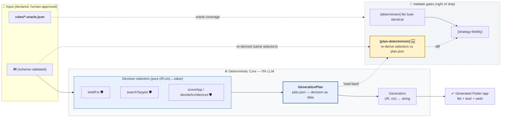
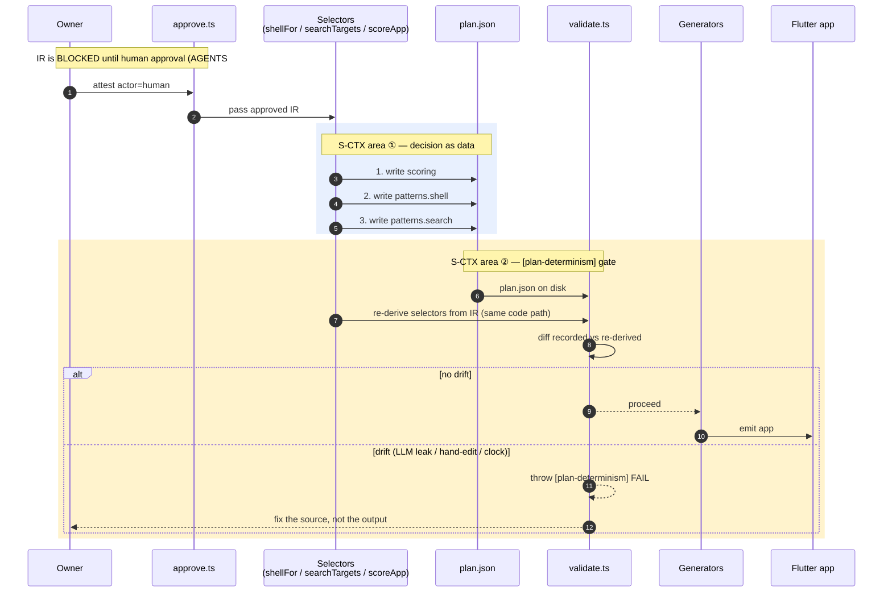

# S-CTX — Plan-Determinism Contract + Gate: Decision Brief

> **Audience:** owner. **Purpose:** make an informed go/no-go on the S-CTX slice before
> implementation. **Form:** executive summary → context → why → options (with priority/impact) →
> findings → recommendation. Companion to `SPIKE_PLAN.md` §S-CTX (the engineering spec).

**Status: RECOMMENDED — implement as scoped.** Date 2026-08-17.

---

## 0. Diagrams — where S-CTX sits

Legend of shading: **amber** = the area this brief decides on (the new `[plan-determinism]` gate);
**light blue** = "decision as data" (the plan selectors); **dashed** = gate/validate groupings.

### Pipeline (IR → selectors → plan → generators → gates)

### Sequence — plan written, then `[plan-determinism]` re-derives + diffs

(PNG renders under `research/mermaid/plan_pipeline.png`, `plan_sequence.png` — embedded in the
PDF version, which is the deliverable.)

---

## 1. Executive summary

The generator's "plan" (`plan.json`) is already 100% derived from the IR through a handful of
pure selector functions (`shellFor`, `searchTargets`, `scoreApp`). That's a *fact*, but nothing
**proves** it stays true — a future accidental LLM call, wall-clock read, or hand-edit inside any
plan-field helper would silently make the plan non-deterministic, and no gate catches it. S-CTX is
a small, zero-generator-change slice that:

1. **Writes down** exactly what composes the plan, field by field, with each derivation cited
   (a `DETERMINISM_CONTRACT.md`).
2. **Adds one validate gate** (`[plan-determinism]`) that re-derives the plan decisions from the
   IR and diffs against the `plan.json` on disk.

Effort ~S (1 slice). Impact: hardens the trust boundary (AGENTS #3: "deterministic core is 0%
LLM") into a *checked* invariant. No generated code, IR, or schema changes.

## 2. Context

- The repo's non-negotiable #3 says the deterministic core is **0% LLM**: generators are pure
  `(IR, ctx) → string`. The plan (`plan.ts`) and gen context (`gen_context.ts`) are the "decision
  as data" layer — what to generate and how.
- Grilling round 1 surfaced **C1** ("ctx is undefined; the determinism invariant is a tautology")
  and **C15** ("an LLM-authored plan recurses nondeterminism"). Both were answered with: "it's
  already true, verified by code reading" — but there was **no standing check** that would fail if
  it ever stopped being true.
- ChatGPT round-2 review hardened this further: "IR-derived" must be a **transitive** property —
  every helper a plan-field derivation calls must itself be pure (no wall clock, filesystem,
  network, randomness, mutable process state).
- The roadmap gates S-CTX first (cheap, and every later spike P3/P4/P5-D2 cites `plan.json` in its
  acceptance). P2 is closed; M4a (scoring selector) just shipped — this is the natural next slice.

## 3. Why it matters (impact)

| Impact axis | With S-CTX | Without |
|---|---|---|
| **Trust boundary (AGENTS #3)** | "0% LLM" is a *checked* invariant — any future leak fails CI | unenforced claim; a leak ships silently |
| **Determinism guarantee** (byte-identical builds) | plan is re-proven from source every validate | plan can drift from IR without notice |
| **Later slices (P3/P4/P5-D2)** | they build on a guaranteed-stable plan.json | they'd inherit a possibly-stale plan |
| **Audit / explainability** | plan provenance is documented field-by-field | "where did this decision come from?" is tribal knowledge |
| **Risk** | low — additive gate only, negative-control proven | structural risk grows with each new pattern slice |

## 4. Options (with priority + impact)

| # | Option | Priority | Effort | Impact | Verdict |
|---|---|---|---|---|---|
| A | **Full S-CTX: contract doc + `[plan-determinism]` gate + negative control** | P1 | S | High (hardens core trust boundary; unblocks roadmap) | **RECOMMENDED** |
| B | Gate only, no contract doc | P2 | XS | Medium — catches drift but doesn't document provenance (grill C1 half-answered) | acceptable fallback |
| C | Contract doc only, no gate | P3 | XS | Low — documentation without enforcement (C1/C15 unresolved) | not recommended |
| D | Do nothing (rely on code-reading "it's true") | — | 0 | None — stays an unproven claim; risk grows with each pattern slice | rejected |
| E | Extend scope: also prove generator purity transitively (scan imports) | P3 | M | High but larger blast radius; touching the gate's scope mid-slice violates small-slice rule | DEFER (note in leftovers) |

## 5. Findings (grounded, from code)

- `GenContext` (`gen_context.ts:18-24`) = `pkg`, `symbols`, `ir`, `sm`, `search`. All fields are
  computed in `index.ts` from the IR + arch layer. No LLM, no clock, no FS.
- `GenerationPlan` (`plan.ts:26-40`): `scoring` + `patterns.{shell,search}` are the only
  decision-bearing fields; both come from pure selectors:
  - `scoring` ← `decideArchitecture(ir)` (`arch.ts:42`) → `scoreApp` (`scoring.ts:108`) — pure.
  - `patterns.shell` ← `shellFor(features, mergedScreens)` (`composition.ts:111`) — pure, feature
    order preserved, no sorting.
  - `patterns.search` ← `searchTargets(ir)` (`composition.ts:173`) re-keyed by `screenPath` in
    `index.ts:723` — pure.
- `searchCheck` (`validate.ts:328`) is the *existing precedent*: it already re-derives search
  decisions from the IR and diffs plan.json. The `[plan-determinism]` gate generalizes exactly this
  pattern to `scoring` + `patterns.shell` + `patterns.search` in one gate.
- Determinism gate (`validate.ts:747`) already regenerates and diffs `lib/` — the new gate is
  additive alongside it (plan.json vs IR, not lib vs IR).
- No current app declares `stateMachines` with a matching status vocabulary (M4a finding) — so the
  plan's `scoring.strategy` strings are stable; gate is cheap to add now.

## 6. Decision

**GO — Option A.** Implement as one small slice:
1. `research/DETERMINISM_CONTRACT.md` — field-by-field derivation map + transitive-purity invariant.
2. `validate.ts` — `[plan-determinism]` gate re-deriving `scoring` + `patterns.*` from IR, diffed
   against `plan.json` on disk.
3. Negative control — hand-edit `plan.json` `patterns.shell` → gate FAILs (proves non-vacuous).
4. Full verify + commit + HANDOFF/CODE_CATALOGUE update.

Acceptance: passes on all 4 apps + all samples; negative control fails; typecheck clean;
no generator changes.
