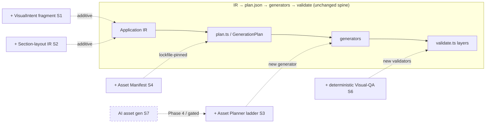

# Visual Screen Generation Proposal — Review & Decision

**From:** Claude Code (implementer) — **To:** Orchestrator / Owner — **Date:** 2026-08-18
**Reviews:** `VISUAL_SCREEN_GENERATION_PROPOSAL.md` (owner, 21 sections)
**Grounded in:** `DESIGN.md` v3 + real generator source (`builder/src/**`) as of P5/D2 Slice 2.
**Scope:** Review + planning only. No generator/app code changed by this document.

---

## 1. Executive verdict

The proposal's spine — *the LLM makes semantic visual decisions, a deterministic compiler renders them* — **is already this project's founding principle** (`DESIGN.md §0`, §5, §9.1, §26). Sections 1, 19, 20, 21 are near-verbatim restatements of the existing trust boundary and are **accepted wholesale**; sections 4, 6, 13, 15, 16, 17 are **already implemented** (theme/token gate, component registry, deterministic strategy selection, P5/D2 state-aware emission, responsive lane, Arabic-first RTL) and need no new work. The genuinely valuable *new* capability is the **visual-richness layer**: a typed `VisualIntent`, a nested section-layout IR, an asset-resolution ladder, an asset manifest, and banner-as-composition — all of which are compatible **as additive semantic IR** (§2.3) and are routed to spikes.

**One hard reject:** the proposal's Section-18 "screenshot → Visual Analyzer → auto-repair" loop, read as an LLM looking at a render and deciding fixes, is an **LLM judge inside the correctness loop** and violates `DESIGN.md §14.6 / §9.4`. Its *intent* (catch overflow/clipping/aspect/contrast/missing-asset defects) is kept and is already largely covered by deterministic validators + human-baselined goldens. **One defer:** AI image/illustration generation (Section 10) is not incompatible but is out of the frozen roadmap and needs the full trust-boundary machinery (provenance, approval gate, manifest cache, lockfile pin) → Phase 4/post-v1.

**Roadmap meaning:** nothing here reorders the frozen plan. `VisualIntent` interleaves with P5/D2; the section-layout/banner richness is a post-P5/D2 additive UI expansion; the asset manifest + visual-QA validators harden alongside S-HERMETIC; AI asset generation is post-v1.

---

## 2. Verdict table (sections 1–21)

| § | Topic | Verdict | Grounding (DESIGN.md § + file) | Note |
|---|---|---|---|---|
| 1 | Screen = Visual UI Specification (semantic) | **ACCEPT** | §0 thesis; §8; §2 IR-as-truth | Project's own principle. "Keemart-level" is a goal, not a mechanism. |
| 2 | Pipeline (semantic→resolve→assets→layout→render→validate) | **MODIFY** | §0 pipeline; §6.1 `plan.ts` | Adopt shape, but map stages onto existing `IR→plan.json→generators→validate`; Asset Planner + Visual QA are new stages, not a parallel pipeline. |
| 3 | Visual Intent (density/personality/hierarchy/radius/imagery/emphasis) | **MODIFY** | §2.3; §5.2 `scoring.ts`; `types.ts:159` (density exists) | Accept as a **closed-enum** additive IR fragment feeding the §5.2 scoring fn; reject free-form. Spike S1. |
| 4 | Design Tokens resolved before components (no random `padding=17`) | **ACCEPT** | §8, §8.1; §14.3 arch-linter; `[theme]` gate `validate.ts:79–111` | **Already implemented** (D1). Raw literals already forbidden. |
| 5 | Asset Planner (existing→library→procedural→generated) | **MODIFY** | §8.1; §2.3; trust boundary §12/§2.2 | Accept the **deterministic resolution ladder** as a new generator; carve out + defer the `generated` (AI) branch. Spike S3. |
| 6 | Icons priority ladder (DS→Material→lib→SVG→generated last) | **ACCEPT** | §8 registry; `components.ts` (`Icon` emission) | Deterministic ladder, mostly satisfied; custom-SVG/project-lib is small additive work. |
| 7 | Images (existing / library / generated; build artifact not runtime) | **MODIFY** | §6.3 determinism; §23 lockfile | Accept existing/library + "asset is a build artifact" rule; `generated` branch deferred to trust-boundary path. |
| 8 | Backgrounds (solid/gradient/pattern/shape/image/generated) | **MODIFY** | §8; §14.4.3 responsive | Accept a **typed** background spec (solid\|gradient\|pattern\|image) rendered deterministically; `generated` deferred. |
| 9 | Composition (build banner from tokenized parts, not whole-banner AI) | **ACCEPT** | §5 (determinism); `composition.ts` (OCP layer) | Textbook deterministic composition; new `HeroBanner` organism = roadmap work. |
| 10 | Generated Illustrations (compiler builds prompt, saves + manifests) | **DEFER (Phase 4)** | §5.4 Novel; §9.5 approval; §2.2 provenance | Prompt-from-spec is fine; external image AI needs full trust machinery + is out of frozen scope. Spike S7. |
| 11 | Asset Manifest (reproducibility/caching/versioning/reuse) | **ACCEPT** | §23 lockfile; §6.3 GenerationContext; §11.2 provenance | Mandated by the trust boundary; becomes a plan/lockfile-pinned artifact. New work. Spike S4. |
| 12 | Layout Generation (section tree as UI IR → renderer) | **MODIFY** | §12 dep graph; §2 IR; `screen.ts` composition | Accept a **section-list** IR additive to `ScreenModel`, rendered deterministically, **no pixel coords**. Spike S2. |
| 13 | Component Selection (reuse→compose→propose new) | **ACCEPT** | §8.1 (select by semantic req); §5.2; §5.4 (new→Novel) | Already the rule; "new component proposal" routes to the human-approved Novel lane. |
| 14 | Order-Tracking example (sections model) | **ACCEPT** | §12; §14 | Demonstrates section-IR; the live `map` element is a datasource/Novel-lane concern, not generator-deterministic. |
| 15 | State-aware Visual Generation (visual state ← state model) | **ACCEPT** | §14.4.2; §10.1; **P5/D2 Slice 2** `StatePlacementSpec` `screen.ts:671`, `statePlacementFor` | **Already implemented** this slice. |
| 16 | Responsive (no pixel coords; constraints computed) | **ACCEPT** | §14.4.3 `ScreenModel.responsive`; overflow validator | **Already satisfied**; "no raw pixels from LLM" is a core non-negotiable. |
| 17 | RTL (spec is language-aware; components RTL-aware) | **ACCEPT** | §16 Arabic-first; ar-first goldens | **Already implemented.** |
| 18 | Visual Validation (screenshot→Visual Analyzer→auto-repair) | **REJECT** | §14.6 (no LLM reviews); §9.4 (LLM judge = triage only) | Reject the LLM-analyzer/auto-repair **mechanism**; keep intent → deterministic validators + golden pixel-diff + human-gated repair. Spike S6. |
| 19 | LLM = semantic decisions only (not coords/colors/padding/files) | **ACCEPT** | §26; §9.1; §5 | Verbatim restatement of the core division. |
| 20 | Deterministic Compiler owns tokens/resolve/layout/gen/l10n/a11y/validate | **ACCEPT** | §26; §6; §14; §20 | Verbatim restatement. |
| 21 | Best Architecture (LLM reasoner → Visual IR → compiler → QA) | **ACCEPT** | §0 pipeline; §6.1 | Endorsed; new nodes (Asset Planner, Visual QA) become roadmap work. |

**Tally:** ACCEPT 13 · MODIFY 6 · DEFER 1 · REJECT 1.

---

## 3. Accepted

**A. Already satisfied by current code — no new work (≠ new code):**

- **§1/§19/§20/§21** — the semantic-decision / deterministic-render division *is* `DESIGN.md §0/§26` and the `IR→plan→generators→validate` pipeline.
- **§4 Design Tokens** — D1 theme system; `[theme]` gate (`validate.ts:79–111`) proves `buildTheme()` is wired and `AppColors.primary` is the declared seed byte-for-byte; arch-linter forbids raw color literals (§14.3).
- **§6 Icons** — component registry emits `Icon(...)` with a semantic contract (`components.ts`).
- **§13 Component Selection** — screens select by semantic requirement from the registry (§8.1); deterministic scoring (`scoring.ts`), never LLM free-choice.
- **§15 State-aware visuals** — delivered this slice: `StatePlacementSpec` + `statePlacementFor` (P5/D2 Slice 2), plus §10.1 state strategies.
- **§16 Responsive** — `ScreenModel.responsive` + the viewport-squeeze overflow validator (§14.4.3); "no pixel coordinates" is a non-negotiable.
- **§17 RTL** — Arabic-first, ar-first goldens (§16).

**B. Accepted but needs new roadmap work (each → a spike in §6):**

- **§9 Banner-as-composition** — new `HeroBanner`/`Banner` organism composed from tokenized parts (Spike S5).
- **§11 Asset Manifest** — a lockfile-pinned, provenance-stamped asset artifact (Spike S4).
- **§14** — richer section modeling reuses the §12 layout accepted below.

---

## 4. Rejected

**§18 — "Flutter build → Screenshot → Visual Analyzer → Compare → Detect → Repair" as an LLM-driven loop.**

- **Violated non-negotiable:** *deterministic checks, not LLM reviews* (`DESIGN.md §14.6`) and *LLM judges are triage, never certification* (§9.4). A model that looks at a render and decides "change `fit: cover → contain`" is exactly the "is the UX good? → YES" anti-pattern the design forbids; it also reintroduces render-time non-determinism into the correctness gate.
- **Keep the validated intent — compatible alternative:** the *defect list itself is good* and mostly already covered deterministically:
  - overflow/clipping → §14.4.3 viewport-squeeze overflow validator (already exists);
  - contrast → §14.4.1 alpha-composited contrast check (already exists);
  - missing assets → resolvable from the Asset Manifest (§11) at plan time;
  - aspect-ratio/image-fit, RTL, component-consistency → deterministic per-screen validators;
  - anything genuinely visual → **golden pixel-diff against a human-approved baseline** (§15 golden workflow), where the human owns the baseline, not an LLM.
  - "Repair" is legitimate only as **deterministic regeneration** (change a token/attribute, re-run — §11.5), never as model-authored patching.
- Spike **S6** proves the defect list is fully covered without a semantic-vision judge.

---

## 5. Modified (each adapted to this architecture)

- **§2 Pipeline.** Adopt the *semantic-first shape*, but do **not** stand up a parallel pipeline. Its stages map onto what exists: *Semantic Screen Model* = agent→IR (§9.1); *Design System Resolver* = token/theme system (§4/§8); *Deterministic Renderer* = the generators; *Visual Validation* = the §14 validator layers. The two truly new stages — **Asset Planner** and **Visual QA** — enter as a new generator and new validators inside `IR→plan.json→generators→validate`, keeping `plan.ts` the single audit/`--dry-run` surface.

- **§3 Visual Intent.** Add a **closed, enum-constrained** `VisualIntent` fragment to `ScreenModel` (`density` already exists at `types.ts:159`; add `hierarchy`, `cornerRadius`, `personality`, `emphasis`). It must be *additive semantic IR* (§2.3) that **feeds the §5.2 deterministic scoring function** to select composition/strategy — never a channel for the LLM to emit raw pixels/colors. Free-form fields are rejected at schema validation.

- **§5 Asset Planner.** Accept as a **deterministic resolution ladder** (existing asset → declared asset library → procedural: solid/gradient/shape), implemented as a pure generator whose every decision is recorded in the manifest (§11). The `generated`/AI branch is split out and deferred (Section 10). This keeps the planner byte-reproducible under GenerationContext (§6.3).

- **§7 Images.** Accept the *existing → library* resolution and the load-bearing rule that **a resolved image is a build artifact, not a runtime generation** (§6.3/§23). The `generated` branch defers to the trust-boundary path.

- **§8 Backgrounds.** Accept a **typed** background spec — `solid | gradient | pattern | image` — consumed by a deterministic renderer using tokens (no raw colors, §14.3). `pattern`/`shape` are procedural; `generated` background defers.

- **§12 Layout Generation.** Accept a declarative **section-list** IR (`Header/Search/Hero/Section[...]`) as an *additive* extension to `ScreenModel` beyond today's `list|detail|form|wizard` archetypes (`composition.ts`), rendered deterministically via the composition layer. Hard constraint: sections carry **constraints, never pixel coordinates** (§14.4.3 / proposal §16); the section tree is UI IR, and `screen.ts`+`composition.ts` remain the sole owners of the emitted layout.

---

## 6. Spike backlog (unbundled, prioritized)

> Each spike is **one hypothesis, one decision** (SPIKE_PROTOCOL §17). Decision verbs: ADOPT / MODIFY / REJECT / ESCALATE.

### S1 — Typed `VisualIntent` fragment drives differentiated composition — **P0**
- **Hypothesis (falsifiable):** A closed-enum `VisualIntent {density, hierarchy, cornerRadius, personality, emphasis}` added to `ScreenModel` is sufficient to make the §5.2 scoring function emit *measurably different* deterministic compositions for 3 sample screens, introducing **zero** new raw literals and staying byte-identical on re-run.
- **Why now:** it is the entry vocabulary for every later visual spike; the shape of this fragment gates all UI-SLC expansion.
- **Decision criteria:** ADOPT if the 3 screens differ deterministically, arch-linter reports no raw literals, and the determinism regression test is byte-identical. MODIFY if ≥1 field never changes output (underdetermined). REJECT if any field forces the LLM to choose a raw pixel/color.

### S6 — Section-18 defect list is fully covered without a vision judge — **P0**
- **Hypothesis:** Every defect the proposal's "Visual Analyzer" targets (overflow, clipping, alignment, spacing, typography, contrast, aspect-ratio, missing-asset, RTL, component-consistency, hierarchy) maps to either an existing/near-term **deterministic validator** or a **human-baselined golden pixel-diff** — no case requires semantic image understanding.
- **Why now:** it decides whether the §18 REJECT leaves an uncovered gap; must be settled before any "visual QA" work is scoped.
- **Decision criteria:** ADOPT (validators+golden suffice) if each defect maps to a concrete check. ESCALATE/keep-for-research any single defect that provably needs semantic vision (product-owner call on whether it's worth a non-deterministic path).

### S2 — Section-layout IR renders richly with zero pixel coordinates — **P1**
- **Hypothesis:** A declarative section-list IR renders a Keemart-style home deterministically using only existing tokens + registry components, with **no** absolute positioning, and passes the overflow validator at 320/390/1400-wide viewports.
- **Why now (vs later):** it is the headline "visual richness" ask, but sits *after* S1 (needs the intent vocabulary) and is a large additive expansion, so it follows the frozen slices rather than interleaving.
- **Decision criteria:** ADOPT if it renders + overflow-clean at 3 viewports + contains no coordinate literals. MODIFY if some sections need a new registry component. REJECT if any section requires absolute x/y.

### S3 — Deterministic asset-resolution ladder (no AI) — **P1**
- **Hypothesis:** For N sample visual roles, the ladder (existing asset → declared library → procedural gradient/shape) resolves without invoking any external generator, and every resolution is a pure function of the IR + manifest.
- **Why now:** unblocks §5/§7/§8 accepts; the AI branch stays stubbed, so no trust-boundary work is needed yet.
- **Decision criteria:** ADOPT if all sample roles resolve deterministically and the arch-linter stays clean. MODIFY if the library schema is insufficient. REJECT if a role can only be satisfied by AI generation (→ defer to S7).

### S4 — Asset Manifest is lockfile-reproducible — **P1**
- **Hypothesis:** Adding an asset manifest to the GenerationContext tuple (§6.3) + lockfile (§23) keeps generation byte-identical across runs and turns asset reuse into a cache hit (no re-resolution).
- **Why now:** it is the trust/reproducibility backbone every asset feature depends on; naturally hardens alongside S-HERMETIC.
- **Decision criteria:** ADOPT if the determinism regression test is byte-identical with the manifest in-context and a second run is a pure cache hit. MODIFY if the manifest must live outside the lockfile.

### S5 — Banner-as-composition matches commercial quality without raster AI — **P2**
- **Hypothesis:** A `HeroBanner` organism composed from tokenized parts (background/headline/subtitle/product-image slot/decoration/CTA) yields a human-golden-approved promo banner with **zero** AI-generated raster.
- **Why now (later):** validates the §9 ACCEPT; nice-to-have polish that can follow S2.
- **Decision criteria:** ADOPT if a human approves the golden and every part is tokenized. MODIFY if decorative shapes need a raster asset (→ routes through S3/S7).

### S7 — AI asset generation can be contained by the trust boundary — **P2 (post-v1 / Phase 4)**
- **Hypothesis:** An externally-generated illustration can be treated as a human-approved, content-hashed build artifact such that regeneration **never re-invokes** the model and the output stays reproducible from the manifest + lockfile.
- **Why now (later):** Section 10 is out of the frozen roadmap and needs §5.4 Novel-lane approval + §9.5 routing + §11 provenance — all Phase-4 machinery.
- **Decision criteria:** ADOPT (later) if the artifact is provenance-stamped, human-approved, content-hashed, and never silently regenerated. REJECT if build reproducibility requires re-invoking a non-deterministic model.

---

## 7. Roadmap slotting

Frozen plan (unchanged, not reordered): **S-CTX → P3 → P4 → P5/D2 → S-HERMETIC**.

| Accepted part | Slot | Interleaved / purely-after | One-line reason |
|---|---|---|---|
| §4/§6/§13/§15/§16/§17 (already satisfied) | — | n/a | Substrate the frozen slices already build on; no slot. |
| **VisualIntent** (S1) | **P5/D2** | Interleaved | Small additive IR fragment; it is the entry vocabulary for UI-SLC, must be spiked before further UI expansion. |
| **Section-layout IR** (S2) + **Banner composition** (S5) | after **P5/D2** | Purely-after | Large additive UI expansion not in the current slices' contracts; follows P5/D2 as a dedicated visual-richness pass. |
| **Asset ladder** (S3) | after **P4** | Interleaved-after | Depends on data-layer (P4) being settled; additive generator, no reorder. |
| **Asset Manifest** (S4) + **deterministic Visual-QA validators** (S6) | **S-HERMETIC** | Interleaved | Reproducibility + goldens/validators harden exactly where the hermetic/lockfile phase lives. |
| **AI asset generation** (S7 / §10) | **Phase 4 / post-v1** | Purely-after | Novel-lane + trust-boundary + reverse-extraction era; outside v1 (v1 = end of Phase 3, §25). |

**Pipeline diff (proposal → this architecture):**

*Reject stays out of the diagram by design:* there is no "LLM Visual Analyzer" node — its role is filled by `+ deterministic Visual-QA (S6)` plus human-owned goldens.
