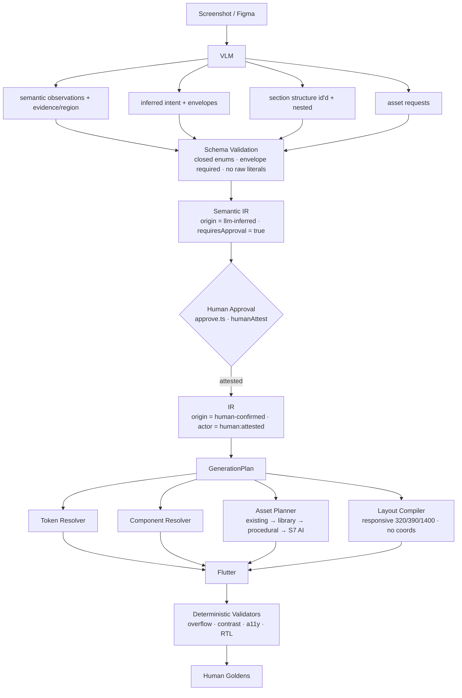

# VLM Design → IR Mapping Contract — v2

**Goal:** teach a Vision-Language (VLM) agent how to look at a visual design (screenshot / figma-export)
and emit schema-valid deterministic **IR** — so a human can later validate and the compiler renders it
byte-identically. The VLM maps *design* to *semantic decisions*; it never draws.

**Status:** v2 of the visual-lane contract (S1 VisualIntent / S2 section-layout / S3 asset ladder — see
`VISUAL_GENERATION_REVIEW.md` §6, spikes S1/S2/S3 and acceptance-check q7; those are referenced here,
**not edited**). Fields marked **(proposed)** are additive fragments not yet in `types.ts`; the rest are
the real IR consumed by `composition.ts`/`screen.ts`/`validate.ts`.

**What changed v1 → v2 (ChatGPT ADOPT-WITH-MODIFY, all 10 points):** (1) a **provenance envelope**
`{origin, confidence, evidence, requiresApproval}` on every *inferred* decision; (2) an explicit
**Observed / Inferred / Proposed / Approved** epistemic split; (3) `sections[]` carry stable **ids** +
optional **parent/children** (nested semantic composition, never arbitrary widget trees); (4) `emphasis`
is a **`targetId`** referencing a section id, not a free value; (5) `AssetRequest` stays **fully
decoupled** from resolution; (6) an **`observations[]`** channel with evidence regions + confidence;
(7) a full **provenance model incl. the post-approval human-attested state**; (8) worked example A drops
`type: market` (uses the existing **`dashboard`** archetype, market is S2-gated); (9) `productGrid`
does **not** imply a column count — columns derive from responsive policy; (10) acceptance checks now
require provenance+confidence on every inferred property and forbid silent promotion to compiler truth.

---

## 0. The invariant (why this works)

```
Design (screenshot) ──VLM──▶ IR (origin=llm-inferred, schema-validated) ──▶ human approval ──▶
IR (origin=human-confirmed, actor=human:attested) ──▶ deterministic compiler ──▶ Flutter ──▶ validators + goldens
```

The VLM output is **decisions, not rendering**. Anything the VLM is *tempted* to draw is instead a
**reference** (token name, semantic role, component id, enum) **carrying its provenance**. The compiler
owns every pixel. Crucially (ChatGPT §1): **the screenshot is not ground truth at extraction time** — it
becomes truth only *after* human attestation. So every non-observed decision must say how confident it is
and what evidence backs it.

### The 5 "never" rules (VLM hard constraints — unchanged from v1)

1. **Never** emit a raw color (`#F4A261`, `Colors.orange`) → emit a semantic role (`brand.primary`) or propose one `brandSeedColor` **with a provenance envelope** for human approval.
2. **Never** emit a pixel/size (`padding: 17`, `radius: 13`, `fontSize: 21`) → emit a token name (`spacing.md`, `radius.card`, `heading`).
3. **Never** emit coordinates as layout (`left: 27, top: 412`) → emit ordered sections + `emphasis.targetId`; layout is computed. *(Coordinates may appear ONLY inside `observations[].evidence.region` as proof — see §1.5 and the hard rule "evidence coordinates ≠ layout coordinates".)*
4. **Never** emit a widget tree (`Column(children:[...])`) → emit a catalog section/component reference, optionally nested via `parent`/`children` (§2.2), never arbitrary Flutter.
5. **Never** emit a file/URL for imagery → emit an `AssetRequest {semanticRole, style, aspectRatio, background}`; resolution is the asset ladder's job (§3).

---

## 1. The epistemic model — Observed / Inferred / Proposed / Approved

ChatGPT's load-bearing correction: the VLM must separate *what it literally saw* from *what it guessed*.
Every decision the VLM emits is one of four epistemic tiers, and the tier fixes the provenance envelope.

| Tier | Meaning | `origin` | `requiresApproval` | Typical confidence |
|---|---|---|---|---|
| **Observed** | Directly present in the pixels (a hero strip exists; there is a search field). | `llm-inferred` | `true` | ≥ 0.95 |
| **Inferred** | Read *through* the pixels (personality=friendly; responsive; carousel auto-plays). | `llm-inferred` | `true` | < 0.95 |
| **Proposed** | A value the VLM *offers* that the catalog/schema doesn't yet contain (a new archetype). | `llm-inferred` | `true` | any |
| **Approved** | A human has attested the value; only now is it compiler truth. | `human-confirmed` | `false` | `1.0` |

> Even an Observed decision `requiresApproval: true` — observation raises confidence, it does **not**
> bypass the approval gate. Nothing becomes compiler truth without the Approved tier.

### 1.5 The provenance envelope (point 1 + point 7)

Every *inferred* property (i.e. everything not deterministically read from an existing IR/entity) carries:

```yaml
someField:
  value: rounded
  origin: llm-inferred          # matches provenance.ts origin enum
  confidence: 0.91              # VLM calibrated probability (weak prior only — §9.4 treats it as such)
  evidence: screenshot-region   # short tag OR an observations[] id (see §1.6)
  requiresApproval: true
```

After human approval (the post-approval state — point 7), the same field becomes:

```yaml
someField:
  value: rounded
  origin: human-confirmed       # real schema value (provenance.ts:17); the actor stamp is human:attested
  actor: human:attested         # HUMAN_ACTOR (provenance.ts:24)
  confidenceSource: human-attested
  confidence: 1.0
  requiresApproval: false
```

**Schema reconciliation (important, keeps this contract implementable):** the review wrote
`origin: human-attested`; the *real* provenance schema (`builder/src/provenance.ts:17`, `DESIGN.md §2.2`)
spells the post-approval origin **`human-confirmed`** and carries the attestation on **`actor:
human:attested`** + `confidenceSource: human-attested`. v2 uses the real field names so the envelope
validates against the existing `Provenance` type; the *intent* (a distinct, human-attested post-approval
state) is fully preserved. `evidence` is the one VLM-specific addition to the envelope and is optional on
non-visual origins.

### 1.6 `observations[]` — evidence with regions (point 6)

The VLM proves *where it saw a thing* in a dedicated channel, kept separate from the IR proper:

```yaml
observations:
  - id: obs.hero
    targetId: primaryHero        # the section/decision this evidences (stable id, §2.2)
    property: type
    value: heroBanner
    confidence: 0.97
    evidence:
      region: [42, 180, 708, 420]   # x,y,w,h in the SOURCE image — proof only
```

**Hard rule — evidence coordinates ≠ layout coordinates.** `observations[].evidence.region` lets the
VLM say "I saw the hero here"; the compiler is **forbidden** from using these numbers to position
anything. Layout is computed from sections + responsive policy + tokens. A validator (acceptance check 9)
asserts no `region` value ever reaches a generator. `observations[]` is advisory input to human review and
to confidence calibration — it is stripped before `GenerationPlan`.

---

## 2. Mapping rules (design → IR)

| Design clue (what you see) | What the VLM emits | Real field / example |
|---|---|---|
| Overall app hue / brand color | `attributes.brandSeedColor` **as an envelope** — ONE hex, only if the dominant brand color ≠ baseline teal `0D9488` | see §2.1 |
| Color roles (success/warning/danger/info) | Semantic roles, not hex | `theme.success: "semantic.success"` |
| Is it dark? | `attributes.themeMode` (Inferred) | `"light" \| "dark" \| "system"` (absent = light) |
| Density (tight vs spacious) | `attributes.density` (Inferred) | `"compact" \| "comfortable"` |
| Reflows on wide screens? | `attributes.responsiveness` (Inferred — the VLM cannot *know* this) | `"mobile" \| "responsive"` |
| Language / mirrored layout | `attributes.locale` | `"en" \| "ar" \| "both"` |
| **Screen type** | `screen.type` — existing archetype id; a *new* archetype is **Proposed + S2-gated** | `"list" \| "detail" \| "wizard" \| "dashboard"` |
| **Visual intent** (proposed S1) | `screen.visualStyle` — closed enums, each an envelope | §2.3 |
| Section order & hierarchy (proposed S2) | `screen.sections[]` — ordered, **id'd**, optionally nested | §2.2 |
| Typography hierarchy | Token roles | `heading`, `body`, `caption`, `label` |
| Corner treatment | `cornerRadius` enum (envelope) | `"sharp" \| "soft" \| "rounded" \| "pill"` |
| Iconography | `icon.semantic` role | `cart`, `search`, `support`, `location` … |
| Imagery | `AssetRequest` (§3) | §3 |
| Row status (stages/stepper) | `screens[].statePlacement` (P5/D2) | `statePlacementFor` (composition.ts) |

### 2.1 `brandSeedColor` — the one allowed hex, always an envelope (point 1 + point 7)

The single hex the VLM may emit, and only wrapped, because a screenshot carries compression / shadows /
gradients / anti-aliasing / overlays that corrupt a sampled color:

```yaml
brandSeedColor:
  value: "#0EA5A4"
  origin: llm-inferred
  confidence: 0.94
  evidence: dominant_ui_chrome     # not a raw pixel sample — the dominant chrome hue
  requiresApproval: true
```

The compiler **rejects any other hex** (acceptance check 2). After approval the envelope flips to
`origin: human-confirmed / actor: human:attested / confidence: 1.0`.

### 2.2 `sections[]` — id'd, optionally nested (points 3 + 4)

`sections[]` is no longer a flat list of catalog types. Each section carries a **stable semantic id** and
may declare **`parent`** (or, equivalently, a parent may declare **`children`**) so richer compositions
are expressible — *without* opening the door to arbitrary widget trees:

```yaml
sections:
  - id: header          # stable semantic id (referenced by emphasis, observations, scoring)
    section: header
  - id: search
    section: search
  - id: primaryHero
    section: heroBanner   # tokenized composition (S5), NOT a single AI image
  - id: offers
    section: productSection
    children: [offersHeader, offersGrid]   # nested semantic composition (ChatGPT §3 preferred form)
  - id: offersHeader
    section: sectionHeader
    parent: offers
  - id: offersGrid
    section: productGrid
    parent: offers
  - id: floatingCart
    section: floatingCart
```

**Constraint (the anti-widget-tree guard):** `section` must be a **catalog** section type and nesting is
**semantic containment only** (a section groups sections). There is no `Column`/`Row`/`Stack`/free child —
the renderer maps each catalog section to its registry component deterministically. A parent/children pair
must be consistent (every `children` id exists and back-points via `parent`); acceptance check 4 enforces
this. Order within a level *is* the visual hierarchy (no coordinates).

### 2.3 `screen.visualStyle` (S1) — closed enums, `emphasis` is a `targetId` (point 4)

```yaml
screen:
  visualStyle:
    hierarchy:                     # each closed-enum decision is an envelope (Inferred)
      value: strong                # soft | balanced | strong
      origin: llm-inferred
      confidence: 0.88
      evidence: obs.hierarchy
      requiresApproval: true
    cornerRadius: { value: rounded, origin: llm-inferred, confidence: 0.93, requiresApproval: true }  # sharp | soft | rounded | pill
    personality:  { value: friendly, origin: llm-inferred, confidence: 0.82, requiresApproval: true } # professional | friendly | premium | playful | minimal
    imagery:      { value: commercial, origin: llm-inferred, confidence: 0.90, requiresApproval: true } # none | commercial | illustrative | photographic
    emphasis:
      targetId: primaryHero        # ← REFERENCES a sections[].id (point 4), never a free value
      origin: llm-inferred
      confidence: 0.86
      requiresApproval: true
```

Rule (unchanged, strengthened): **`visualStyle` never directly selects a widget or asset.**
`personality: friendly` → the *§5.2 scoring function* prefers rounded cards + generous spacing from the
registry — not `use FriendlyCard`. `emphasis.targetId` must resolve to a real `sections[].id`, so
`VisualIntent → scoring` is traceable (acceptance check 4).

---

## 3. Asset requests (S3 ladder) — fully decoupled from resolution (point 5)

ChatGPT §4: this is one of the strongest parts of the contract — **do not expand it**, and keep the
boundary absolute. The VLM emits a semantic *request*; it never knows a path, URL, or filename.

```yaml
assets:
  - id: baked_bread_hero
    type: illustration        # illustration | photo | banner | icon
    semanticRole: grocery_delivery
    style: friendly_3d        # commercial_product | friendly_3d | isometric | flat_illustration | photo
    aspectRatio: 16:9
    background: transparent   # transparent | neutral | brand
    provenance:               # the request itself is Inferred
      origin: llm-inferred
      confidence: 0.9
      requiresApproval: true
```

Resolution is the compiler's job, 0% LLM, and lives **entirely outside** this contract:

```
VLM → AssetRequest → Asset Planner → existing project asset → declared library → procedural gradient/shape → (S7, post-v1) AI + human approval + content-hash + manifest + lockfile
```

An AI image, once approved, is an **immutable, content-hashed asset** — the compiler does not care who
made it. The VLM stops at the request; it has zero visibility into which ladder rung resolved it.

---

## 4. Worked example A — Keemart-style grocery Home (v2 shape)

### INPUT (what you show the VLM)
A home screenshot: brand-green header with store logo + delivery-time meta; a rounded search field;
an auto-playing hero banner strip ("Ready For School" + product image + "Shop Now" CTA); a horizontal
"Discover more" card rail; a 2-column "Weekly offers" product card grid (price + old price + add
button); a floating cart FAB bottom-right. Light theme, generous spacing, rounded corners, friendly.

### RESULTING IR (what the VLM must return)

```jsonc
{
  "schemaVersion": "3",
  "name": "grocery_market",
  "attributes": {
    "refreshCadence": "occasional",
    "density":        { "value": "comfortable", "origin": "llm-inferred", "confidence": 0.88, "requiresApproval": true },
    "responsiveness": { "value": "responsive",  "origin": "llm-inferred", "confidence": 0.55, "evidence": "cannot be confirmed from one screenshot — low confidence", "requiresApproval": true },
    "locale":         { "value": "both",        "origin": "llm-inferred", "confidence": 0.70, "requiresApproval": true },
    "themeMode":      { "value": "light",       "origin": "llm-inferred", "confidence": 0.97, "requiresApproval": true },
    "brandSeedColor": { "value": "#0EA5A4",     "origin": "llm-inferred", "confidence": 0.94, "evidence": "dominant_ui_chrome", "requiresApproval": true },
    "stateManagement": "bloc"
  },
  "entities": [
    {
      "id": "Product",
      "fields": [
        { "name": "id", "type": "String" },
        { "name": "title", "type": "String" },
        { "name": "price", "type": "double", "semanticType": "Money", "currency": "SAR" },
        { "name": "oldPrice", "type": "double", "semanticType": "Money", "currency": "SAR", "nullable": true },
        { "name": "stockStatus", "type": "String", "of": "InStockStatus", "default": "open" },
        { "name": "categoryField", "type": "String", "of": "Category" }
      ]
    }
  ],
  "screens": [
    {
      "name": "HomeScreen",
      "entity": "Product",
      "type": "dashboard",                    // ← point 8: existing archetype, NOT "market".
                                              //   A "market" archetype is S2-gated (see note below).
      "state": "HomeCubit",
      "visualStyle": {                        // S1 — every enum an envelope; emphasis is a targetId
        "hierarchy":   { "value": "strong",     "origin": "llm-inferred", "confidence": 0.88, "requiresApproval": true },
        "cornerRadius":{ "value": "rounded",    "origin": "llm-inferred", "confidence": 0.93, "requiresApproval": true },
        "personality": { "value": "friendly",   "origin": "llm-inferred", "confidence": 0.82, "requiresApproval": true },
        "imagery":     { "value": "commercial",  "origin": "llm-inferred", "confidence": 0.90, "requiresApproval": true },
        "emphasis":    { "targetId": "primaryHero", "origin": "llm-inferred", "confidence": 0.86, "requiresApproval": true }
      },
      "sections": [                           // S2 — id'd; order IS the hierarchy; no column counts
        { "id": "header",       "section": "header" },
        { "id": "search",       "section": "search" },
        { "id": "primaryHero",  "section": "heroBanner" },
        { "id": "discover",     "section": "horizontalCards" },
        { "id": "offers",       "section": "productSection", "children": ["offersHeader", "offersGrid"] },
        { "id": "offersHeader", "section": "sectionHeader", "parent": "offers" },
        { "id": "offersGrid",   "section": "productGrid",   "parent": "offers" },
        // ↑ point 9: productGrid does NOT carry "columns": 2. The 2-column look is EVIDENCE only
        //   (obs.offersGrid). Columns derive from responsive policy: 320→1, 390→2, 1400→N.
        { "id": "floatingCart", "section": "floatingCart" }
      ]
    }
  ],
  "assets": [
    { "id": "back_to_school", "type": "banner", "semanticRole": "promotion",
      "style": "flat_illustration", "aspectRatio": "16:9", "background": "brand",
      "provenance": { "origin": "llm-inferred", "confidence": 0.9, "requiresApproval": true } }
  ],
  "observations": [                           // point 6 — evidence, stripped before GenerationPlan
    { "id": "obs.hero",       "targetId": "primaryHero", "property": "type",    "value": "heroBanner", "confidence": 0.97, "evidence": { "region": [42, 180, 708, 420] } },
    { "id": "obs.offersGrid", "targetId": "offersGrid",  "property": "columns", "value": 2,            "confidence": 0.99, "evidence": { "region": [16, 980, 708, 640] } }
    // obs.offersGrid records the *observed* 2 columns as PROOF; it is NOT written into offersGrid.
  ]
}
```

**S2-gate note (point 8):** the input reads like a "commercial market home", but `market` is **not** a
real archetype in `composition.ts` yet. Emitting it would smuggle a Proposed value in as catalog truth.
So v2 uses the existing **`dashboard`** archetype. The path to a real `market` archetype is:
`S2 proves market archetype → catalog addition (composition.ts) → contract update` — never the reverse.

### Per-field description (why each line exists)
- `brandSeedColor` — the ONE acceptable hex, and only as an **envelope** (§2.1): after approval every
  color derives from `ColorScheme.fromSeed`; no other color is emitted.
- `responsiveness.confidence: 0.55` — deliberately low: the VLM *cannot* know reflow behavior from one
  static frame (ChatGPT §1). The envelope makes that honesty machine-readable for the reviewer.
- `visualStyle` → scoring selects composition (hero-first order, rounded, generous) — **not** a widget.
- `sections[]` → the renderer maps each to a registry component deterministically, responsive at
  320/390/1400, RTL-aware under `locale: both`. **No section carries a column count.**
- `observations[]` → proves what was seen; consumed by human review + confidence calibration; discarded
  before the compiler runs.

---

## 5. Worked example B — Order Tracking (state-aware, v2 shape)

### INPUT
Order detail: a map header with a translucent status banner over it; a 3-step
"Preparing → Out for delivery → Delivered" stepper (currently *preparing*, amber accent); delivery
address + contact card; delivery instructions; store summary; order items list; promo banner; support row.

### RESULTING IR (delta)

```jsonc
{
  "entities": [
    { "id": "Order", "fields": [
        { "name": "id", "type": "String" },
        { "name": "title", "type": "String" },
        { "name": "status", "type": "String", "of": "OrderStatus", "default": "preparing" }
    ] }
  ],
  "stateMachine": { "name": "Order", "states": ["preparing", "picked_up", "out_for_delivery", "delivered", "cancelled", "failed"] },
  "screens": [
    {
      "name": "OrderDetailScreen",
      "entity": "Order",
      "type": "detail",
      "state": "OrderCubit",
      "visualStyle": {
        "hierarchy":   { "value": "strong",      "origin": "llm-inferred", "confidence": 0.85, "requiresApproval": true },
        "cornerRadius":{ "value": "rounded",     "origin": "llm-inferred", "confidence": 0.9,  "requiresApproval": true },
        "personality": { "value": "friendly",    "origin": "llm-inferred", "confidence": 0.8,  "requiresApproval": true },
        "imagery":     { "value": "illustrative", "origin": "llm-inferred", "confidence": 0.75, "requiresApproval": true },
        "emphasis":    { "targetId": "orderStatus", "origin": "llm-inferred", "confidence": 0.9, "requiresApproval": true }
      },
      "sections": [
        { "id": "map",                 "section": "map", "children": ["orderStatusBanner"] },
        { "id": "orderStatusBanner",   "section": "orderStatusBanner", "parent": "map" },  // overlay = nested, not coords
        { "id": "orderStatus",         "section": "orderStatus", "state": "preparing" },
        { "id": "deliveryAddress",     "section": "deliveryAddress" },
        { "id": "customerContact",     "section": "customerContact" },
        { "id": "deliveryInstruction", "section": "deliveryInstruction" },
        { "id": "storeSummary",        "section": "storeSummary" },
        { "id": "orderItems",          "section": "orderItems" },
        { "id": "promotionBanner",     "section": "promotionBanner" },
        { "id": "support",             "section": "support" }
      ],
      "statePlacement": {                 // from P5/D2 StatePlacementSpec (composition.ts) — field-derivative
        "key": "status",
        "loading": true, "failure": true, "empty": false
      }
    }
  ],
  "observations": [
    { "id": "obs.map",    "targetId": "map",         "property": "type",  "value": "map",     "confidence": 0.9,  "evidence": { "region": [0, 0, 750, 360] } },
    { "id": "obs.stepper","targetId": "orderStatus", "property": "state", "value": "preparing","confidence": 0.93, "evidence": { "region": [24, 380, 700, 120] } }
  ]
}
```

The stepper's *amber "preparing" accent* is **not** a color choice — it maps to `semantic.warning`,
driven by the `status` enum member (`state: "preparing"` inside the `orderStatus` section). Every status
member gets its visual accent deterministically; the UI is never a static image. The `map`'s status
banner is expressed as a **nested child** (`orderStatusBanner.parent = map`), not as an overlay at pixel
coordinates — keeping "no widget trees, no coordinates" intact while allowing the overlay composition.
Note `map` liveness is Inferred at modest confidence (a screenshot can't prove the map is a live element).

---

## 6. Schema grounding (real vs proposed, incl. provenance)

| IR field | Status | Where |
|---|---|---|
| `app.attributes.{density, responsiveness, themeMode, brandSeedColor, locale}` | **real** | `builder/src/types.ts:157` (`AppAttributes`) |
| `screen.{name, entity, type, state, hero, steps, export}` | **real** | `types.ts:265` (`ScreenModel`) |
| `statePlacement` | **real (P5/D2)** | `statePlacementFor` (composition.ts) + `screen.ts:671` |
| **Provenance envelope** `{origin, confidence, requiresApproval, actor, confidenceSource}` | **real** | `builder/src/provenance.ts:16–33` (`Provenance`, `stampElement`) |
| Post-approval state `origin=human-confirmed`, `actor=human:attested` | **real** | `provenance.ts:24` (`HUMAN_ACTOR`), `:45–49` (`humanAttest`) |
| Envelope `evidence` tag | **proposed (v2)** | VLM-specific; optional; stripped before GenerationPlan |
| `observations[]` + `evidence.region` | **proposed (v2)** | evidence channel; never reaches a generator (§1.6) |
| `screen.visualStyle` (+ `emphasis.targetId`) | proposed S1 | `VISUAL_GENERATION_REVIEW.md` S1 |
| `screen.sections[]` (+ `id`/`parent`/`children`) | proposed S2 | S2 |
| `assets[]` + Asset Manifest | proposed S3/S4 | S3 + S4 |
| `heroBanner` composition | proposed S5 | S5 |

The envelope fields reuse the **existing** `Provenance` type (`provenance.ts`), so an enveloped decision
validates today; `evidence` + `observations[]` are the only genuinely new (proposed) additions, and both
are advisory — they are consumed by human review and confidence calibration, then dropped, so they can
never become compiler input.

---

## 7. VLM output acceptance checks (extended — point 10)

1. **JSON schema-validates** (closed enums; the only hex allowed is one optional `brandSeedColor`).
2. **Zero raw literals**: no hex (except the single enveloped `brandSeedColor`), no px, no fontSize/weight numbers, no layout coordinates. `observations[].evidence.region` is the *only* place numeric geometry may appear, and it is evidence, not layout.
3. Every `semanticRole` / `semantic` icon id resolves to the role vocabulary.
4. Every `section`/`component` id resolves to the catalog; every `sections[].id` is unique; every `parent`/`children` reference is consistent (child ↔ parent back-reference, no cycles, no orphan children); `emphasis.targetId` resolves to a real `sections[].id`; `visualStyle` enums are all closed.
5. Every referenced field exists on a real entity; `status`-driven placements use real enum members.
6. **Every inferred property carries a provenance envelope** `{origin, confidence, requiresApproval}` (point 10a). A closed-enum/attribute/asset/`brandSeedColor` decision with no envelope is a **hard reject**.
7. **No silent promotion** (point 10b): no `llm-inferred` value may become compiler truth except through the approval gate (`builder/src/approve.ts` → `humanAttest`, flipping to `origin=human-confirmed`, `actor=human:attested`, `requiresApproval=false`). A `GenerationPlan` built over any element still `requiresApproval:true` is rejected.
8. `observations[]` are well-formed (each has `id`, `targetId` resolving to a section/decision, `confidence`, `evidence.region`) and are **stripped before `GenerationPlan`** — a `region` value reaching a generator is a hard failure (evidence ≠ layout).
9. Any archetype/section type **not** in the current catalog is emitted at the **Proposed** tier and is **S2-gated**: it blocks generation until the catalog is extended (no `type: market` shortcut).
10. Regeneration is **byte-identical** (determinism regression) — the *attested* IR, not the screenshot, is the source of truth.

---

## 8. The Design Reverse Compiler pipeline (final shape)

This contract is more than "VLM turns a screenshot into JSON": it defines a **Design Reverse Compiler** —
visual evidence → semantic design grammar → deterministic UI compiler. The VLM is a *semantic
decision-maker only*; the compiler owns truth and execution (`DESIGN.md §0/§26`).



`observations[]` and `evidence.region` feed **B → E** (human review + confidence calibration) and are
dropped at the `C → D` boundary; they never enter `GenerationPlan`. The gate `E` is the single point where
`llm-inferred` becomes `human-confirmed` — the only door to compiler truth (acceptance checks 7, 10).
This is exactly the trust boundary already in place (`DESIGN.md §9.1`, `provenance.ts`): the VLM/LLM is a
semantic decision-maker; the compiler is the owner of truth and every pixel.
